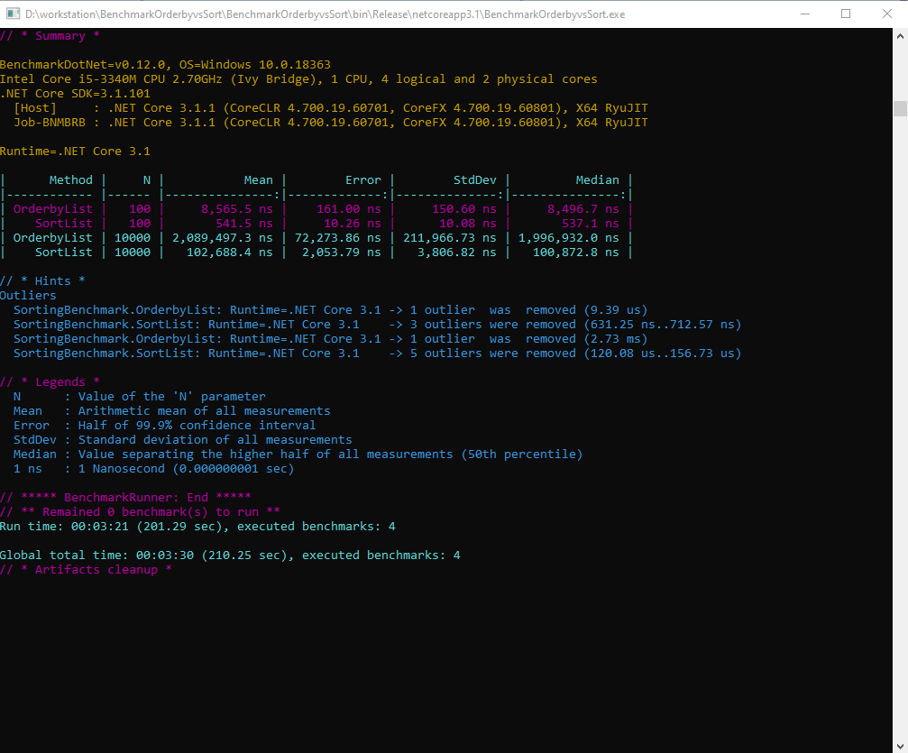

# Benchmarking List.Sort() vs OrderBy

base on the performance test summary sorting list using sort() is much faster than using Linq OrderBy(),
to undestand what's happen i analyse the code source of Linq (thanks to microsoft, the net core is open source we can read the code from github)
https://github.com/dotnet/corefx/blob/master/src/System.Linq/src/System/Linq/OrderBy.cs
There is an overhead because Linq functions work on IEnumerable<TSource> interface, so it can work on List, Array, or Collection implement IEnumerable (custom collection), so Orderby transform the list to Buffer 

Orderby overhead
- Create OrderedEnumerable 
- store the enumerable items into an array before sorting them O(n)
- executing ToList()

Orderby still very usefull function, i recommend to use it in two case : 
- working with ORM like EF 
- if you want to implement generic library function that works on IEnumerable
but in the simple case when you have an array or list of objects it better to use List.Sort() or Array.Sort().
